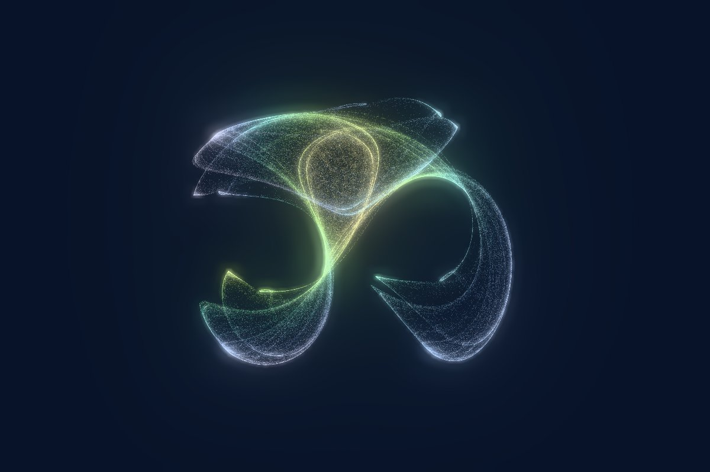
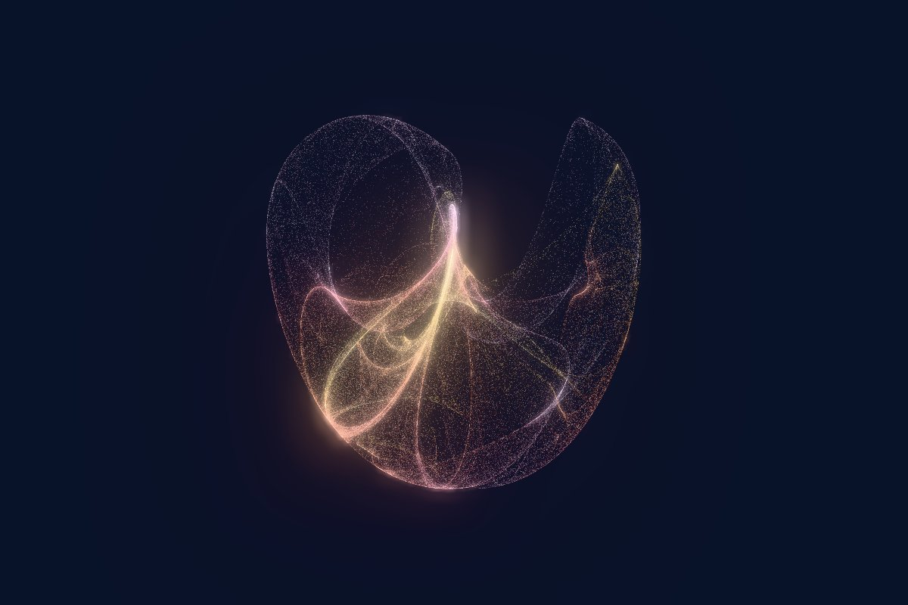

# Strange Attractor Visualizer

**[▶ Open the live demo](https://pmiloslavsky.github.io/strange_attractor_visualizer/)**


Real-time 3D strange attractors in the browser: thousands of particles with
glowing, fading trails, palette coloring by speed / age / height, bloom, and
drag-to-orbit camera controls. A from-scratch web rebuild of the C++/SFML/TGUI
[ode_simulation](https://github.com/pmiloslavsky/demo/tree/master/ode_simulation)
demo, keeping its seven systems, their parameter tables, and its three photo
balls riding along the flow. It adds two classic 2D chaotic maps, Clifford and
Peter de Jong, drawn as clouds of hundreds of thousands of points.

Static site, no backend. Vite + TypeScript + Three.js.

## The attractors

| | | |
|:---:|:---:|:---:|
| <br>**Lorenz** | <br>**Chen–Lee** | <br>**Rössler** |
| <br>**Aizawa** | <br>**Three-Scroll Unified** | <br>**Thomas** |
| <br>**Dadras** | <br>**Clifford** (2D map) | <br>**Peter de Jong** (2D map) |

Where these equations come from, who discovered them, and links to the
original papers: **[README_ATTRACTOR_HISTORY.md](README_ATTRACTOR_HISTORY.md)**.

## Controls

Drag to orbit (with inertia), scroll or pinch to zoom. The camera slowly
auto-rotates until you turn it off.

The control panel (a side panel on desktop, a pull-up sheet on phones) has:

- **Attractor picker**: thumbnails of all nine systems. Switching cross-fades
  and glides the camera to the new shape.
- **Equations** of the current system.
- **Parameters**: a slider per parameter, with the original's ranges, plus a
  preset menu of the known interesting parameter sets. Picking a preset morphs
  the attractor smoothly. The panel warns you when a setting diverges or
  collapses to a fixed point.
- **Simulation**: dt, speed, integrator (the original's Euler or Runge-Kutta 4),
  particle count (up to 8,000; 400,000 for maps), trail length, particle
  size, pause, reseed. Maps always iterate one step at a time, so dt,
  integrator and trails don't apply to them and are hidden.
- **Color**: color by speed, age, height or particle; six palettes; color
  cycling; trail brightness.
- **Glow**: bloom strength, radius and threshold.
- **Camera**: auto-rotate and its speed, auto-framing when parameters resize
  the attractor, and a button to re-frame.
- **Capture**: save a PNG screenshot.

Keyboard:

| Key | Action |
| --- | --- |
| 1–9 | Switch attractor |
| C / P | Cycle color mode / palette |
| R | Toggle auto-rotate |
| `[` `]` | Fewer / more particles |
| `-` `=` | Shorter / longer trails |
| F | Show / hide the photo balls |
| S | Save a PNG screenshot |
| Space | Pause |
| H | Hide the on-screen UI |

### Photo balls

As in the original, three photo-textured balls ride on the first three
particles. The round thumbnails under "Photo balls" in the panel show them. Click one
to replace that photo with an image from your computer. Your choice is
remembered in this browser only and never uploaded. ↺ restores the original
photos, and ◉ (or F) hides the balls. They only appear on the flows: on a map,
points jump across the plane every iteration.

## Develop

```bash
npm install
npm run dev      # http://localhost:5173
npm test
npm run build    # static output in dist/
```

## Layout

- `src/attractors/`: one file per system with equations, parameter ranges,
  example sets, default dt and particle size (ported from the original `DE`
  table).
- `src/simulation/`: integrators, reference-trajectory analysis, and the
  particle system with its trail ring buffer.
- `src/scene/`: Three.js stage (camera, controls, bloom), trail and particle
  shaders, palettes, photo balls.
- `src/app/`: the `App` class tying simulation, view and camera together; the
  single API the panel and keyboard use.
- `src/ui/`: the control panel (Tweakpane) and photo tray.
- `public/family/`: the default photo-ball images from the original project.
- `public/thumbs/`: attractor picker thumbnails.

## Deploy

Pushing to `main` builds, tests and publishes to GitHub Pages via
`.github/workflows/deploy.yml`.
