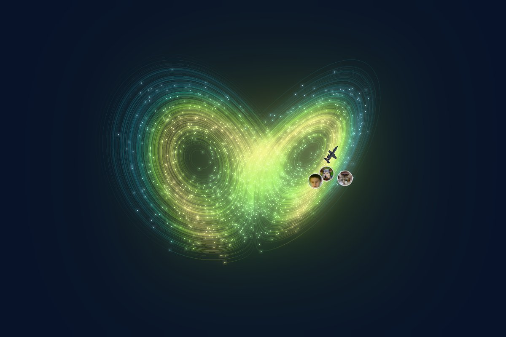
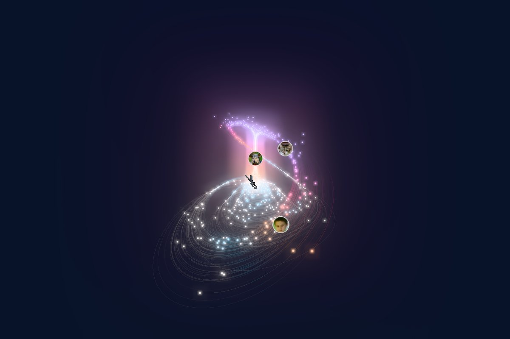
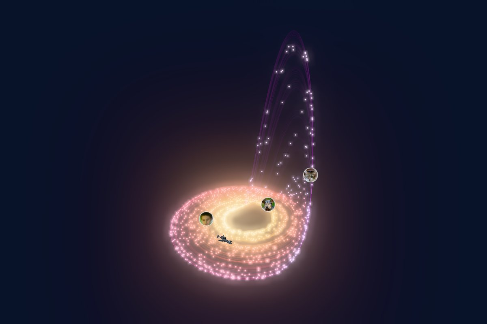
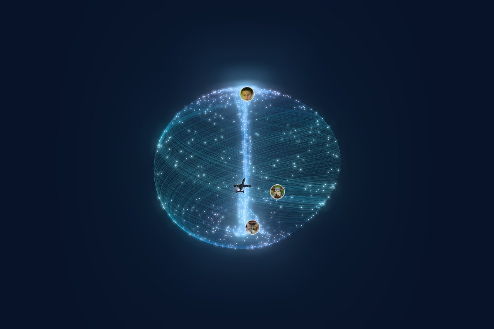
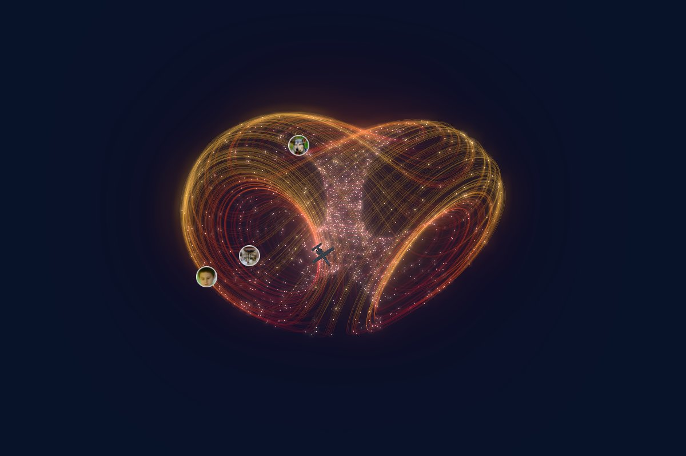
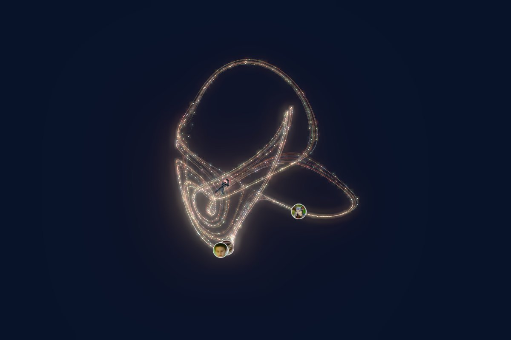
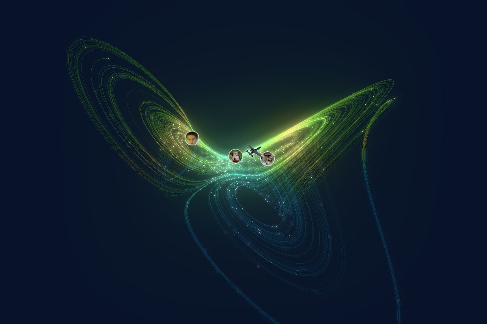
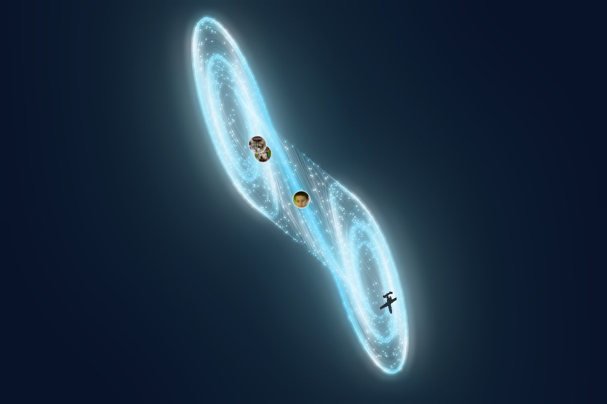
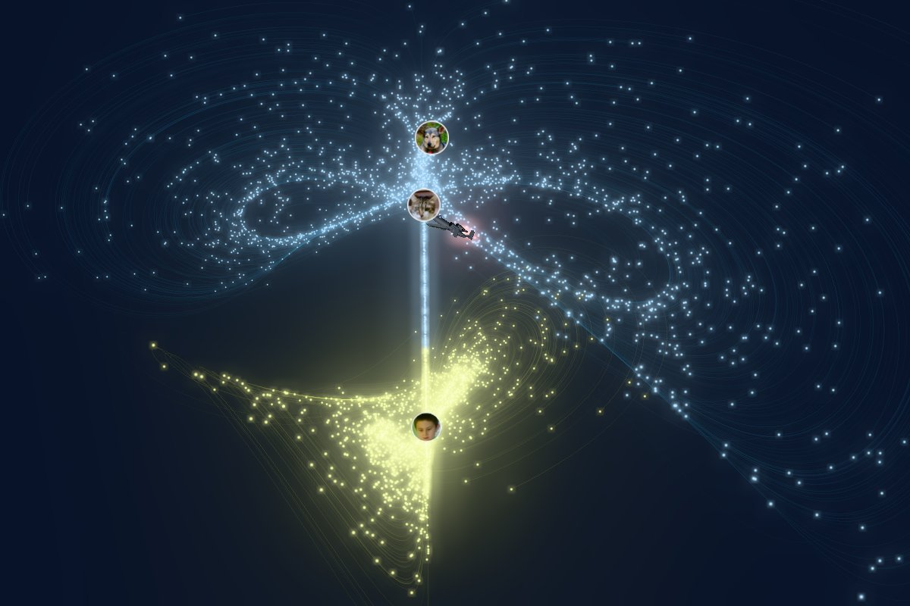
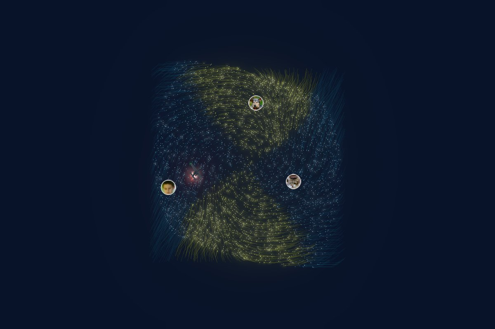

# Strange Attractor Visualizer

**[▶ Open the live demo](https://pmiloslavsky.github.io/strange_attractor_visualizer/)**



Real-time 3D strange attractors in the browser: thousands of particles with
glowing, fading trails, palette coloring by speed / age / height, bloom, and
drag-to-orbit camera controls. A from-scratch web rebuild of the C++/SFML/TGUI
[ode_simulation](https://github.com/pmiloslavsky/demo/tree/master/ode_simulation)
demo, keeping its seven systems, their parameter tables, and its three photo
balls riding along the flow. It adds Chua's circuit (the famous double
scroll), the Newton–Leipnik system (two attractors at once, with particles
colored by which one they reach), and an A-10 Warthog flying with the
particles.

Static site, no backend. Vite + TypeScript + Three.js.

## The attractors

| | | |
|:---:|:---:|:---:|
| <br>**Lorenz** | <br>**Chen–Lee** | <br>**Rössler** |
| <br>**Aizawa** | <br>**Three-Scroll Unified** | <br>**Thomas** |
| <br>**Dadras** | <br>**Chua's circuit** | <br>**Newton–Leipnik** (two attractors) |

### Which attractor will a starting point reach?

Newton–Leipnik has two attractors at the same parameters. Selecting it seeds
particles on a flat slice through the space, each colored by the attractor it
will end up on (worked out in advance by running a copy of that particle
forward). The slice shows the dividing pattern, a bowtie, before the particles
fly off and assemble into the two differently colored attractors:




Where these equations come from, who discovered them, and links to the
original papers: **[README_ATTRACTOR_HISTORY.md](README_ATTRACTOR_HISTORY.md)**.

## Exploring the chaos

Beyond looking pretty, the panel has tools for seeing *why* these systems are
chaotic:

- **Chaos meter.** A live estimate of the largest Lyapunov exponent λ: how
  fast two almost identical states drift apart. It reports *chaotic*
  (λ clearly positive), *periodic* (λ ≈ 0) or *fixed point* (λ negative), with
  an error estimate and the time for a small separation to double. It uses the
  same equations, dt and integrator as the particles. With Runge-Kutta 4 it
  reproduces the published Lorenz value, λ ≈ 0.906.
- **Butterfly effect.** One button (or B) restarts every particle inside a ball
  a thousandth the size of the attractor. Within seconds the cluster smears
  across the whole shape: sensitive dependence on initial conditions, made
  visible.
- **Parameter sweep & bifurcation diagram.** Pick a parameter and a range to
  see what the system settles into at each value: one line for a simple loop,
  lines splitting in two as the period doubles, then a smear once it turns
  chaotic. Rössler's c is the textbook example. "Sweep" animates the live
  simulation across the range with a cursor on the diagram, and clicking the
  diagram jumps to that value.
- **Poincaré section.** A plane you can slide through the attractor. Every time
  a particle crosses it (upward) it leaves a dot, shown on the plane in 3D and
  in a 2D plot. A periodic loop becomes a single dot and a strange attractor a
  thin fractal curve, which reveals its layered structure. Classic planes are
  preset for Lorenz (z = 27) and Rössler (y = 0).
- **Ride along.** A chase camera that follows one of the photo balls through
  the flow. Esc or dragging the view returns to the overview.
- **Axes.** The original's reference axes: red x, green y, blue z from the
  origin (A, or the Camera folder).

### A note on numerical accuracy

Like the original, the default integrator is simple Euler steps, and the
step size can change the answer, not just the precision. The chaos meter made
this visible. With Euler at the original's dt = 0.01, the chaotic Rössler
attractor becomes a periodic loop, so its default here is dt = 0.002.
Newton–Leipnik's two attractors merge into one at dt = 0.01, so its default
is 0.002 too. Three-Scroll measures chaotic with Euler but close to periodic
with Runge-Kutta 4, so treat its default with some suspicion. Switch the
integrator in the Simulation folder to compare.

## Controls

Drag to orbit (with inertia), scroll or pinch to zoom. The camera slowly
auto-rotates until you turn it off.

The control panel (a side panel on desktop, a pull-up sheet on phones) has:

- **Attractor picker**: thumbnails of all nine systems. Switching cross-fades
  and glides the camera to the new shape.
- **Equations** of the current system, and the **chaos meter**.
- **Parameters**: a slider per parameter, with the original's ranges, plus a
  preset menu of the known interesting parameter sets. Picking a preset morphs
  the attractor smoothly. The panel warns you when a setting diverges or
  collapses to a fixed point.
- **Parameter sweep & bifurcation diagram** and **Poincaré section** (see
  above).
- **Simulation**: dt, speed, integrator (the original's Euler or Runge-Kutta 4),
  particle count (up to 8,000), trail length, particle size, pause, reseed,
  the butterfly-effect reseed, and "Seed basin slice" for Newton–Leipnik.
- **Color**: color by speed, age, height or particle (and by attractor for
  Newton–Leipnik); six palettes; color cycling; trail brightness.
- **Glow**: bloom strength, radius and threshold.
- **Camera**: auto-rotate and its speed, auto-framing when parameters resize
  the attractor, x/y/z axes, a button to re-frame, and "ride with" a photo
  ball or the A-10.
- **Capture**: save a PNG screenshot.

Keyboard:

| Key | Action |
| --- | --- |
| 1–9 | Switch attractor |
| C / P | Cycle color mode / palette |
| R | Toggle auto-rotate |
| `[` `]` | Fewer / more particles |
| `-` `=` | Shorter / longer trails |
| B | Butterfly effect: restart as one tiny cluster |
| V | Ride along with a photo ball or the A-10 (again: next one) |
| Esc | Stop riding |
| A | Show / hide the x/y/z axes |
| F | Show / hide the photo balls |
| J | Show / hide the A-10 Warthog |
| S | Save a PNG screenshot |
| Space | Pause |
| H | Hide the on-screen UI |

### Photo balls

As in the original, three photo-textured balls ride on the first three
particles. The round thumbnails under "Photo balls" in the panel show them. Click one
to replace that photo with an image from your computer. Your choice is
remembered in this browser only and never uploaded. ↺ restores the original
photos, and ◉ (or F) hides the balls.

A fourth rider, an **A-10 Warthog** in dark charcoal, flies along its own
particle. It stays upright, banks into turns, and its engine exhaust grows
brighter and longer the faster the flow is moving. (The real A-10 has no
afterburners; these are for show.) ✈ (or J) toggles it, and "ride with → A-10"
(or V) puts the camera behind it.

## Develop

```bash
npm install
npm run dev      # http://localhost:5173
npm test
npm run build    # static output in dist/
```

## Layout

- `src/attractors/`: one file per system with equations, parameter ranges,
  example sets, default dt and particle size (ported from the original `DE`
  table).
- `src/simulation/`: integrators, reference-trajectory analysis (including
  multiple attractors), the particle system with its trail ring buffer, and
  the analysis tools: Lyapunov meter, bifurcation diagram, Poincaré section.
- `src/scene/`: Three.js stage (camera, controls, bloom), trail and particle
  shaders, palettes, photo balls, the A-10, section plane, axes.
- `src/app/`: the `App` class tying simulation, view and camera together; the
  single API the panel and keyboard use.
- `src/ui/`: the control panel (Tweakpane), sweep and Poincaré sections, and
  the photo tray.
- `public/family/`: the default photo-ball images from the original project.
- `public/thumbs/`: attractor picker thumbnails.

## Deploy

Pushing to `main` builds, tests and publishes to GitHub Pages via
`.github/workflows/deploy.yml`.
